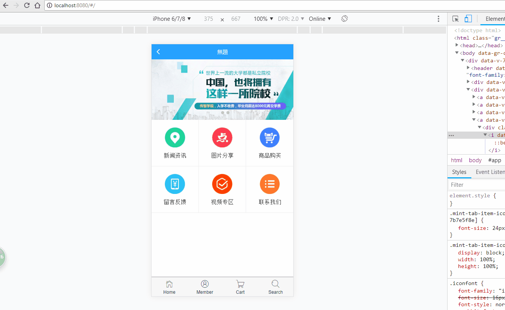
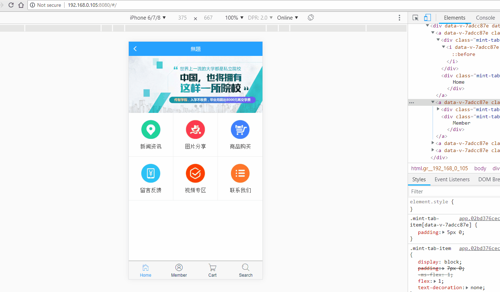
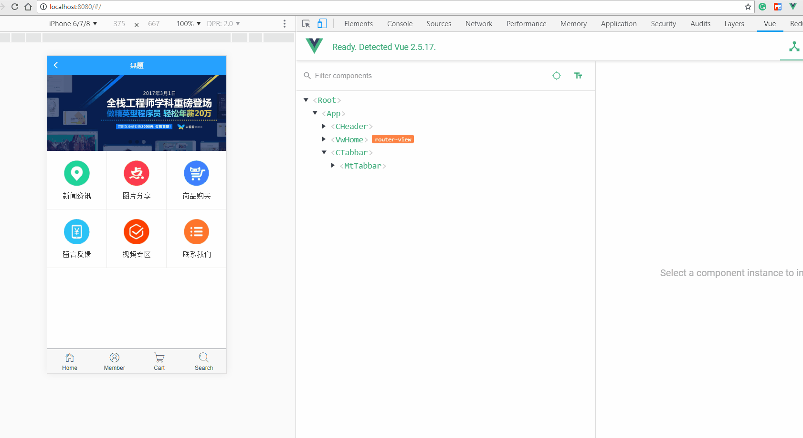
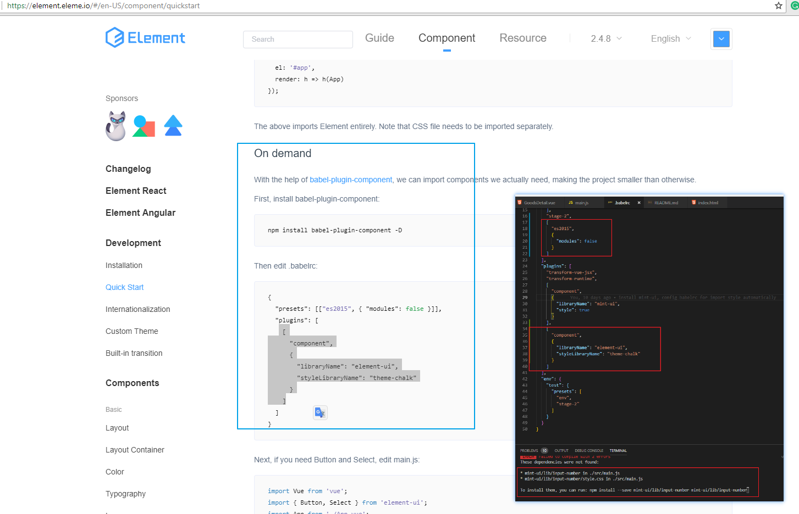
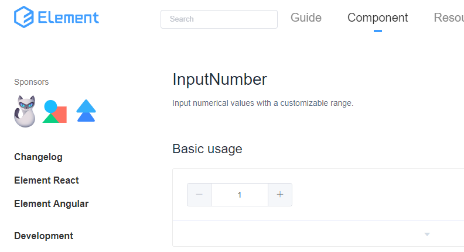
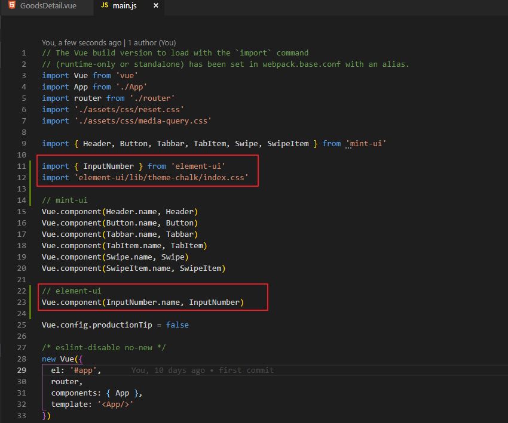

# a_mobile_super_mini_project

> A Vue.js project

## Build Setup

``` bash
# install dependencies
npm install

# serve with hot reload at localhost:8080
npm run dev

# build for production with minification
npm run build

# build for production and view the bundle analyzer report
npm run build --report

# run unit tests
npm run unit

# run all tests
npm test
```

For a detailed explanation on how things work, check out the [guide](http://vuejs-templates.github.io/webpack/) and [docs for vue-loader](http://vuejs.github.io/vue-loader).

## fetch

```js
fetch('http://www.liulongbin.top:3005/api/getnewslist')
  .then(function (response) {
    console.log(response);
  })
  .then(function (data) {
    console.log(data.message);
  })
```

## Technology stack

[mint-ui](http://mint-ui.github.io/#!/en)
[mui](http://dev.dcloud.net.cn/mui/)
[axios](https://github.com/axios/axios)
[element-ui](https://element.eleme.io/#/en-US)

## babel-plugin-component

```json
{
  "presets": [
    [
      "env",
      {
        "modules": false,
        "targets": {
          "browsers": [
            "> 1%",
            "last 2 versions",
            "not ie <= 8"
          ]
        }
      }
    ],
    "stage-2"
  ],
  "plugins": [
    "transform-vue-jsx",
    "transform-runtime",
    // import style automatically
    [
      "component",
      {
        "libraryName": "mint-ui",
        "style": true
      }
    ]
  ],
  "env": {
    "test": {
      "presets": [
        "env",
        "stage-2"
      ]
    }
  }
}
```

## static file

静态资源需要放到 static 文件夹下，否则也需要进行路由匹配 ( Static resources need to be placed in the static folder, otherwise, route matching is required. )

```html
<!DOCTYPE html>
<html>

<head>
  <meta charset="utf-8">
  <meta name="viewport" content="width=device-width,initial-scale=1.0">
  <title>a_mobile_super_mini_project</title>
  <link rel="shortcut icon" href="./static/favicon.ico">
  <link rel="stylesheet" type="text/css" href="./static/iconfont.css">
</head>

<body>
  <div id="app"></div>
  <!-- built files will be auto injected -->
</body>

</html>
```

## iconfont.cn

Using the iconfont downloaded from iconfont.cn

## BUG-001

Priority: ☆

```css
.mint-tab-item-label {
  font-size: 11px; /* 为啥不管用 */
}
```

## BUG-002

Priority: ☆☆☆

On the mobile phone side, while clicking the tab item, the background color will flash.

Sudoku

Tabbar

## BUG-003

body 颜色不能改变

## BUG-004

点击 Header 的返回按钮后， Tabbar 对应的链接高亮不同步

点击浏览器返回按钮，高亮不同步



## BUG-005

跳转到 newslist 或 piclist 后，点击 home 图标无法返回 home





## BUG-006

element-ui 样式按需导入报错

```json
{
  "presets": [
    [
      "env",
      {
        "modules": false,
        "targets": {
          "browsers": [
            "> 1%",
            "last 2 versions",
            "not ie <= 8"
          ]
        }
      }
    ],
    "stage-2",
    // 按需导入 element-ui
    [
      "es2015",
      {
        "modules": false
      }
    ]
  ],
  "plugins": [
    "transform-vue-jsx",
    "transform-runtime",
    [
      "component",
      {
        "libraryName": "mint-ui",
        "style": true
      }
    ],
    // 按需导入 element-ui
    [
      "component",
      {
        "libraryName": "element-ui",
        "styleLibraryName": "theme-chalk"
      }
    ]
  ],
  "env": {
    "test": {
      "presets": [
        "env",
        "stage-2"
      ]
    }
  }
}
```



## mt-tab-item

```js
/***/ 177:
/***/ function(module, exports) {

module.exports={render:function (){var _vm=this;var _h=_vm.$createElement;var _c=_vm._self._c||_h;
  return _c('a', {
    staticClass: "mint-tab-item",
    class: {
      // <a data-v-7ba5bd90="" class="mint-tab-item is-selected">
      // _vm.$parent.value derived from <mt-tabbar v-model="selected">
      // The value will be dynamically changed when which link has been clicked ( id of component mt-tab-item )
      'is-selected': _vm.$parent.value === _vm.id
    },
    on: {
      "click": function($event) {
        // value of selected derived from _vm.id
        // @click="$parent.$emit('input', id)" <- tab-item.vue
        _vm.$parent.$emit('input', _vm.id)
      }
    }
  }, [_c('div', {
    staticClass: "mint-tab-item-icon"
  }, [_vm._t("icon")], 2), _vm._v(" "), _c('div', {
    staticClass: "mint-tab-item-label"
  }, [_vm._t("default")], 2)])
},staticRenderFns: []}
```


## Passing Static or Dynamic Props

<https://vuejs.org/v2/guide/components-props.html#Passing-Static-or-Dynamic-Props>

```html
<!-- App.vue -->
<mt-tabbar v-model="selected" :class="{'is-fixed': fixed}" :fixed="fixed">

<script>

  export default {
    name: 'App',
    data: function () {
      return {
        selected: null,
        fixed: true
      }
    }
  }
</script>

<!-- tabbar.vue -->
<script>
export default {
  name: 'mt-tabbar',

  props: {
    fixed: Boolean, // value derived from :fixed="fixed"
    value: {} // value derived from v-model
  }
};
</script>
```


## add padding-top and padding-bottom for route content

```css
.hello[data-v-469af010] {
    padding-top: 40px;
    padding-bottom: 51px;
}
```


## Vue instance router property

<https://vuejs.org/v2/guide/migration-vue-router.html#Router-Initialization>

```js
new Vue({
  el: '#app',
  router: router, // Router Initialization
  template: '<router-view></router-view>'
})
```

## vm.$mount()

<https://vuejs.org/v2/api/#el>

<https://48y127owv7.codesandbox.io>

Provide the Vue instance an existing DOM element to mount on. It can be a CSS selector string or an actual HTMLElement.

After the instance is mounted, the resolved element will be accessible as vm.$el.

If this option is available at instantiation, the instance will immediately enter compilation; otherwise, the user will have to explicitly call **vm.$mount()** to manually start the compilation.

## Vue router demo

<https://codesandbox.io/s/48y127owv7>

## Click the relevant link to show the relevant component content ( 单击相关链接以显示相关组件内容 )

<https://blog.csdn.net/wandoumm/article/details/80166414>

Use watch property to listening to the changing of the component id ( 使用 watch 监听组件 id 值的变化 )

### Programmatic Navigation

<https://router.vuejs.org/guide/essentials/navigation.html>

Inside of a Vue instance, you have access to the router instance as $router.

```js
watch: {
  // Which link has been clicked
  selected: function (newVal) {
    let compID = newVal
    switch (compID) {
      case 'iHome':
        console.log(this.$route) // {name: "HelloWorld", meta: {…}, path: "/", hash: "", query: {…}, …}
        console.log(this.$router) // access to the router instance ( VueRouter {app: Vue ...} )
        console.log('iHome')
        break;
    }
  }
}

```

### Router Construction Options

<https://router.vuejs.org/api/#router-construction-options>

```js
declare type RouteConfig = {
  path: string;
  component?: Component;
  name?: string; // for named routes
  components?: { [name: string]: Component }; // for named views
  redirect?: string | Location | Function;
  props?: boolean | string | Function;
  alias?: string | Array<string>;
  children?: Array<RouteConfig>; // for nested routes
  beforeEnter?: (to: Route, from: Route, next: Function) => void;
  meta?: any;

  // 2.6.0+
  caseSensitive?: boolean; // use case sensitive match? (default: false)
  pathToRegexpOptions?: Object; // path-to-regexp options for compiling regex
}
```

## Vue-router instance static properties

```js
// vue-router.js -- line 263
var route = {
  name: location.name || (record && record.name),
  meta: (record && record.meta) || {},
  path: location.path || '/',
  hash: location.hash || '',
  query: query,
  params: location.params || {},
  fullPath: getFullPath(location, stringifyQuery$$1),
  matched: record ? formatMatch(record) : []
};
```


## Vue instance API Reference ( Options / Data )

<https://vuejs.org/v2/api/#Options-Data>

<https://vuejs.org/v2/api/#name>

## Another benefit of specifying a name option is debugging ( Vue instance name property )

Another benefit of specifying a name option is debugging. Named components result in more helpful warning messages. Also, when inspecting an app in the vue-devtools, unnamed components will show up as <AnonymousComponent>, which isn’t very informative. By providing the name option, you will get a much more informative component tree.

```js
// Cart.vue
  export default {
    name: 'Cart', // if not the name of component will be anonymous ( while debugging )
    data() {
      return {
        msg: 'cart'
      }
    }
  }

//index.js
export default new Router({
routes: [
  {
    path: '/cart',
    name: 'Cart',
    component: Cart
  }
]
})
```


## what's next

implement Header back function

should not display when the current route is home

## BootstrapVue

yarn add bootstrap-vue

<https://bootstrap-vue.js.org/docs/>

```js
// main.js
import bContainer from 'bootstrap-vue/es/components/layout/container'
import bRow from 'bootstrap-vue/es/components/layout/row'
import bCol from 'bootstrap-vue/es/components/layout/col'

Vue.component('b-container', bContainer)
Vue.component('b-row', bRow)
Vue.component('b-col', bCol)

import 'bootstrap/dist/css/bootstrap.css'
import 'bootstrap-vue/dist/bootstrap-vue.css'

// equivalent to below
import { Layout } from 'bootstrap-vue/es/components'

import 'bootstrap/dist/css/bootstrap.css'
import 'bootstrap-vue/dist/bootstrap-vue.css'

Vue.use(Layout)
```

```html
<!-- Home.vue -->
<template>
  <div class="c-home">
    <b-container class="bv-example-row">
      <b-row>
        <b-col>1 of 6</b-col>
        <b-col>2 of 6</b-col>
        <b-col>3 of 6</b-col>
        <b-col>4 of 6</b-col>
        <b-col>5 of 6</b-col>
        <b-col>6 of 6</b-col>
      </b-row>
    </b-container>
  </div>
</template>
```

## Git Repository URL

<https://github.com/MonguDykrai/A_Vue_MoBile_Super_Mini_Project>

## mui

### cdn

css:

<https://cdnjs.cloudflare.com/ajax/libs/mui/3.7.1/css/mui.css>
<https://cdnjs.cloudflare.com/ajax/libs/mui/3.7.1/css/mui.min.css>

style:

<https://cdnjs.cloudflare.com/ajax/libs/mui/3.7.1/js/mui.js>
<https://cdnjs.cloudflare.com/ajax/libs/mui/3.7.1/js/mui.min.js>

## media-query

Conclusion: When not matched, *the default font-size of the html tag is 20px?* ( 结论：*未匹配时，html 标签默认的 font-size 为 20px？* )

```css
@media screen and (max-width: 320px) {
  html {
    font-size:17.06667px;
  }
}

@media screen and (min-width: 540px) {
  html {
    font-size:28.8px;
  }
}
```

screen < 320px ⇒ font-size: 17.0667px;

320px < screen < 540px ⇒ font-size: ( 63 / 3.15 = 20px );

screen \> 540px ⇒ font-size: 28.8px;


```css
@media screen and (min-width: 320px) {
  html {
    font-size:17.06667px;
  }
}

@media screen and (min-width: 540px) {
  html {
    font-size:28.8px;
  }
}
```

screen < 320px ⇒ font-size: ( 63 / 3.15 = 20px );

320px < screen < 540px ⇒ font-size: 17.0667px;

screen \> 540px ⇒ font-size: 28.8px;


<https://codesandbox.io/s/1o1xmyro37>

## component

[input-number](https://element.eleme.io/#/en-US/component/input-number)



## element-ui



## Go previous view ( click header component arrow sign back to previous view )

1. must to use the [native qualifier](https://vuejs.org/v2/guide/components-custom-events.html#Binding-Native-Events-to-Components) to qualify the click event, or will not trigger function goPreviousView

2. the property of component router-link cannot be omitted.

```html
<template>
  <mt-header title="無題" :style="{fontFamily: 'Microsoft YaHei Light'}" :class="{'is-fixed': fixed}">
    <router-link to="" @click.native="goPreviousView" slot="left">
      <!-- must to use the native qualifier to qualify the click event, or will not trigger function goPreviousView -->
      <mt-button icon="back" v-if="$route.path != '/'"></mt-button>
    </router-link>
  </mt-header>
</template>

<script>
/* eslint-disable */
  export default {
    name: 'c-header',
    props: ['fixed'],
    methods: {
      goPreviousView: function () {
        this.$router.go(-1) // equivalent to `this.$router.back()`
      }
    }
  }
</script>

<style scoped>
</style>
```